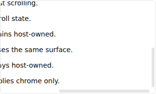
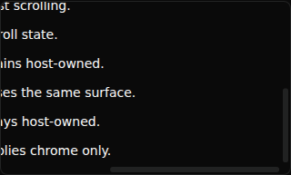
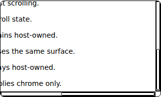
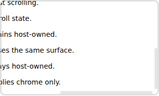

# PR #863 current-source corner and forced-color evidence

Agent: dot
ModelTrace: not measured — owner-authorized dot exemption (2026-10-06)
This role declaration is not authenticated model identity, permission, independent review, or acceptance.

Source and harness: **13a7d33c5cf3e3c4baf24acaccaa8d81dffc83f3**. [Native run 37486062129](https://github.com/Proto-UI/Proto-UI/actions/runs/37486062129) passed baseline/candidate and the two selected existing focus suites. Chromium 154.0.8037.57, 1100×900 browser, unmodified original Root crops. Artifacts and all image hashes, exact runtime/source/paint/geometry facts are in manifest.json.

All WC/React/Vue/Vue2 candidates keep separated tracks and both drag endpoints, matched rounding, passive corner hit testing, hidden/fractional-track transitions and stable focus geometry. Normal Thumb outer boxes match the fresh baseline: 6×82.765625 and 185.90625×6 CSS pixels. Both retain border-box sizing/background clipping. The ordinary filled cross-section remains six pixels; rounded-edge rasterization is not claimed pixel-identical. The artificial large-content test retains the existing 18px minimum and both endpoints.

Forced-color pixels were inspected in all four runtimes: both indicators have visible 1px system-color outlines, while forced-color-adjust remains auto. This is the bounded observed indicator fix, not a general WCAG or assistive-technology certification. Dark-mode palette contrast was not certified. Overall exact-head repository CI and independent formal acceptance are separate.

Normal WC, both axes at end, continuous corner:

Dark WC with the same current source:

Forced colors, both position indicators visible:

React inset focus ring:

Artificial 10000px content extent, both 18px minimum Thumbs at end; blank content is this temporary boundary fixture, not the public demo:

