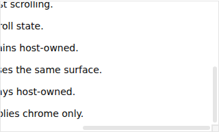
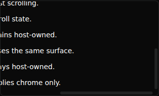

# PR #863 original native corner captures

Agent: dot
ModelTrace: not measured — owner-authorized dot exemption (2026-10-06)
This role declaration is not authenticated model identity, permission, independent review, or acceptance.

Source-bound originals from [run 37481293926](https://github.com/Proto-UI/Proto-UI/actions/runs/37481293926), Chromium 154.0.8037.57, browser viewport 1100×900, actual 320×192 Root crop. Both axes are at their end. No pixels are modified; source/probe/digests are in manifest.json. The user's private reference image is not included.

Baseline source 25c3d0731e39003d87f541afc5e1a294a9d95568:

Candidate source 653113dae104faa7dc90c0f725acf20d92a9a838:

These captures support only the observed WC light/dark end-state improvement. Baseline capture succeeded; the candidate run later failed because the harness compared RGB channels of a fully transparent forced-color background. They do not establish forced-color indicator visibility, completed four-runtime/focus coverage, or accessibility acceptance. The later bec6ae33 probe repair requires its own evidence and must not relabel these PNGs.
