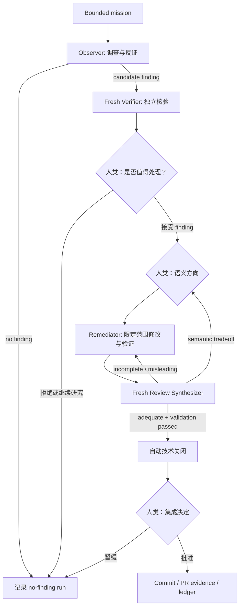

# Proto UI Agent 自主维护教程

这篇教程面向希望使用当前 Phase 0.1 流程的 Proto UI 维护者。它解释什么时候适合使用、如何启动每个阶段、需要向 Agent 提供什么，以及人类在什么地方必须做决定。

这套流程用于维护已有项目事实，不是通用 feature-development 流程。它不会替代 `spec/**`，也不会自动授权 commit、merge 或 release。

## 一分钟判断：这个任务适合吗

适合使用的任务通常同时满足两个条件：

1. 可以限制在一个可穷举的语义切片内；
2. 存在独立于 Agent 判断的 external oracle。

常见适用场景：

| 场景 | 可用 oracle | 例子 |
| --- | --- | --- |
| Spec 与实现漂移 | active/draft criterion、可执行行为 | 某个 lifecycle transition 与 contract 不一致 |
| 测试证据图缺口 | verifies/covers/implementation relations | test entity 声称覆盖 Adapter criterion，但没有可寻址 case |
| 跨 Adapter 语义不一致 | 共享 criterion、React/Vue/Web Component observable behavior | 相同 prop withdrawal 在三个宿主得到不同 resolved value |
| 失败和恢复路径 | 错误码、listener/resource state、cleanup evidence | bind 失败后残留 listener |
| 公共文档投影漂移 | applicable spec guarantee、实际渲染文本 | 中英文文档把两种 fallback 顺序写成一种 |
| Release 或 package 健康度 | build、install、smoke、registry evidence | package 可构建但 clean consumer 无法导入 |

不适合直接使用：

- 已经明确要实现的普通 feature；
- 纯审美偏好或没有 oracle 的重构愿望；
- 需要先决定产品方向才能判断对错的问题；
- 无法限制范围的“检查整个项目有什么问题”；
- 要求 Agent 自动合并、发布或提升 stable guarantee 的任务。

## 整体流程



这里的“自动技术关闭”表示不再需要例行的人类代码正确性批准。它不表示 Agent 可以自动 commit、merge 或 release。

## 关键角色

### Observer

负责自主调查一个未知问题空间。它必须主动形成竞争假设并尝试反证，不能修改 tracked files。

### Verifier

在 fresh task 中从仓库和 finding 原始材料重新验证，不继承 Observer 的隐藏推理，也不接收预期结论。

### Controller 或调度任务

当前由维护者和主任务共同承担。它选择下一阶段、保存结果、集中提出人类决策，并维护 queue 和 ledger。

### Remediator

只有在 finding 已接受且语义方向明确后才能修改仓库。修改范围必须服从 Verifier 修正后的 scope。

### Review Synthesizer

在 fresh task 中检查 packet 是否真实描述了行为变化、影响面、authority、证据限制和残余风险。它不做产品决定，也不替代人类授权集成。

## 开始前

- 使用 Node.js 22 和仓库声明的 pnpm 版本。
- 阅读 `AGENTS.md`，确认 `spec/**` authority 和 lifecycle 规则。
- 运行 `corepack pnpm@10.32.1 spec:docs:agent`，读取本地 Agent project understanding。
- 记录当前 HEAD 和 `git status --short`；已有用户修改必须与本次 mission 清楚区分。
- 确认这次工作只执行一个阶段。需要独立性的下一阶段必须新开 task。

## 第一步：准备一个 bounded mission

从 [`mission-queue.yaml`](./mission-queue.yaml) 选择候选，或者新建一份 mission 文件。一个合格 mission 至少要写清：

- objective：唯一目标；
- scope：entity、criterion、实现、测试和投影边界；
- oracle：用什么事实判定问题成立；
- validation floor：最少运行哪些检查；
- stop condition：什么时候必须停止；
- mutation policy：Phase 0 Observer 必须是 read-only。

例如，`AM-P0-004` 可以被进一步冻结为：

```text
目标：检查一个 lifecycle-sensitive Props 或 Event 行为，确认 React、Vue、
Web Component 三个 active Adapter profile 是否保留相同 portable semantics。

范围：只选择一个 Module + Host Capability + Adapter + Test entity chain。

Oracle：applicable spec criteria、三个 Adapter 的 observable behavior、
focused contract/browser evidence。

停止：报告最多一个经过反证的 finding，或明确报告没有 finding。
不得修改 tracked files。
```

避免使用“全面检查 Event”“寻找尽可能多的问题”这类无法判断完成度的任务。

## 第二步：启动 Observer

新开一个 Codex task，在同一仓库中发送：

```text
Use $pui-observe to run the Observer stage for
internal/autonomous-maintenance/phase-0/missions/<mission>.md.

Remain read-only and stop after the Observer report.
```

也可以直接复制 [`prompts/observer.md`](./prompts/observer.md)，替换其中的 `[MISSION_SCOPE]`。

Observer 完成时应提供：

- baseline commit 和起始/结束 `git status`；
- entity、criterion 和 lifecycle；
- expected/observed behavior；
- reproduction 和实际命令结果；
- supporting 与 counter evidence；
- root cause、impact、confidence；
- 明确的 no-finding 结论，若没有假设通过反证。

### 真实例子：AM-P0-003

Observer 没有被告知一个已知文档 bug。它从 `C-PROPS-0009`、实现、测试和中英文页面出发，发现页面把 `missing` 与 provided-unusable 的 fallback 顺序写成同一种。这个 finding 有 active criterion 和实际渲染文本作为 oracle，因此可以进入 Verifier。

## 第三步：用 fresh task 独立核验

不要在 Observer task 中继续验证。新开 task，只传递 candidate finding、仓库和 [`prompts/verifier.md`](./prompts/verifier.md)：

```text
Use $pui-verify to verify this candidate finding.

Finding:
<paste finding or provide its repository path>

Do not assume it is correct. Remain read-only and stop after classification.
```

Verifier 必须给出以下分类之一：

- `confirmed`；
- `partially confirmed`；
- `not reproducible`；
- `expected behavior`；
- `unresolved semantic question`。

### 真实例子：AM-P0-002

Observer 报告 Event bind 失败后存在部分 listener。Verifier 独立复现了顺序相关的中间态，但也证明：

- 反转 registration 顺序时不会残留 listener；
- 官方 Web Adapter 正常路径降低了用户可见风险；
- 相关 entities 是 draft，没有明确规定首次 bind 的稳定原子性。

因此 finding 被评为 `partially-confirmed`，并从“稳定规范违约”收窄为“特定 target-resolution 失败路径的实现健壮性问题”。

## 第四步：向人类集中请求决定

Controller 不应只问“要不要修”。它需要提供一个集中的 decision packet：

- 已核验事实和 confidence；
- 推荐接受、拒绝或继续研究；
- 批准后允许修改的准确范围；
- 明确排除项；
- material residual risks；
- 批准将触发的下一阶段；
- commit、merge、publication、release 中哪些仍未授权。

人类需要区分两件事：

1. finding 是否值得处理；
2. 如果涉及语义，目标行为应该是什么。

对于 active guarantee，通常是决定是否保持现有语义并修复漂移。对于 draft direction，可能需要明确接受一种新的或更窄的行为。

## 第五步：创建 remediation review packet

在修改行为前，根据 [`templates/remediation-review.md`](./templates/remediation-review.md) 创建 packet。proposal 阶段至少需要声明：

- pre-existing active authority；
- pre-existing draft direction；
- 本次 proposed semantics；
- planned spec/implementation/test paths；
- direct、indirect、excluded、unknown surfaces；
- evidence claims 和每项 evidence 的限制；
- residual risks。

这一步的目标不是增加文档数量，而是让人类无需从大型 diff 中逆向推断行为范围。

## 第六步：限定范围修复和验证

Remediator 可以在语义批准后修改仓库。推荐顺序：

可以在控制任务中发送：

```text
Use $pui-remediate to remediate the accepted finding at
internal/autonomous-maintenance/phase-0/findings/<finding>.md.

Follow the approved semantic scope and update the remediation review packet.
Do not commit, push, merge, publish, or release.
```

1. 先运行最小 reproduction；
2. 修改 authority 或 projection，取决于 finding 类型；
3. 修改实现；
4. 增加 executable coverage；
5. 更新 packet 为 actual diff；
6. 先跑 focused tests，再跑与风险相称的 workspace checks；
7. 运行：

```sh
corepack pnpm@10.32.1 check:autonomous-review
```

### 三种实际修复形态

`AM-P0-001` 是证据图缺口，不是 runtime bug：修复集中在 Adapter contract tests 和 `T-PROPS-0012` mapping。

`AM-P0-002` 是 draft lifecycle 健壮性：修复包括 draft criteria、Event target preflight 实现和 retry/cleanup tests。

`AM-P0-003` 是 projection drift：active contract 和 runtime 已正确，因此只修改中英文文档和两个 source comments。

不要因为流程允许修改 spec、实现和测试，就默认每个 finding 都需要同时修改三者。

## 第七步：独立审查 remediation

新开 task，传递 finding、packet、baseline、仓库和 actual diff，使用 [`prompts/review-synthesizer.md`](./prompts/review-synthesizer.md)：

```text
Use $pui-maintenance-review to independently review this remediation.

Finding: <path>
Packet: <path>
Baseline: <full commit SHA>

Inspect the actual diff. Remain read-only. Do not make the product or
integration decision.
```

可能结果：

- `adequate`：packet 足够准确，可结合 validation 判定技术完成；
- `incomplete`：方向大致正确，但缺少决策相关信息；
- `misleading`：重要的 authority、scope、impact 或 evidence claim 错误；
- `blocked`：缺少 baseline 或必要证据。

### packet 被退回是正常结果

`AM-P0-003` 第一轮被评为 `misleading`。审查发现 packet 遗漏第二处矛盾注释，并把 Node 20 证据写得像满足了 Node 22 baseline。修订 packet、补充注释和 Node 22 evidence 后，第二轮达到 `adequate / 0.99`。

不要把“审查没一次通过”视为流程失败。审查能够改变实现范围或证据表述，正是它存在的原因。

## 第八步：技术关闭和集成

满足以下条件时，技术 remediation 可以自动完成：

- independent review 是 `adequate`；
- required validation 是 `passed`；
- 没有 residual risk 标记为 blocking。

关闭时同步 finding、review packet、mission、queue 和 [`runs.yaml`](./runs.yaml)，并运行：

```sh
corepack pnpm@10.32.1 check:autonomous-maintenance
```

在独立审查已经记录后，可以在控制任务中发送：

```text
Use $pui-maintenance-close to perform the Close stage for
<finding ID>. Do not commit or push; return the concentrated integration
decision packet when closure checks pass.
```

随后 Controller 再向人类集中请求 integration decision。批准应精确说明：

- 哪些文件组成一个或多个 commit；
- 是否允许 push 到现有 PR；
- 是否允许 merge；
- 是否允许 publication 或 release。

技术完成本身不推导出这些权限。

## no-finding 应该如何工作

`AM-P0-005` 专门用于测试 Observer 是否能在没有缺陷时停止。一个有效 no-finding run 应说明：

- 已遍历哪些 entity chain 和 evidence；
- 哪些怀疑被怎样反证；
- 为什么剩余差异属于允许的 host-specific behavior、draft uncertainty 或非问题；
- validation floor 的实际结果；
- Observer 没有创建 tracked mutation。

Observer 停止后，由控制者在新的状态转换中使用 `$pui-record`。它只在最新本地自主上限、完整授权、当前 lease、目标版本与准确变更范围一致时同步 mission、queue 与 run ledger。这个转换不要求 remediation review，因为没有发生修复；它也不能拿来绕过已接受 finding 的独立复核。Verifier 判定 finding 不成立并取得人工 disposition 后，使用同一个终态转换记录 rejected outcome。

不要为了提高 finding 数量，把以下内容包装成问题：

- 已被 spec 明确允许的 Adapter 差异；
- open question；
- draft 中尚未决定的方向；
- 单纯命名或措辞偏好；
- 缺少外部 oracle 的“看起来可以更好”。

## 常见误区

### “测试通过，所以 packet 肯定正确”

测试只能证明被执行的行为。它不能证明影响面完整、语义值得接受，或公共文档没有漂移。

### “Verifier 确认 finding，所以可以直接修”

确认事实不等于批准产品语义。finding disposition 和 semantic decision 是两个门禁。

### “Review Synthesizer adequate，所以可以 merge”

`adequate` 只支持技术完成。commit grouping、merge 和 release 仍属于 integration gate。

### “在同一个 task 里要求 Agent 忘记之前的结论，就等于独立审查”

不是。Observer、Verifier 和 Review Synthesizer 必须使用 fresh task context。

### “把所有 residual risk 都加入当前 fix 更完整”

这会破坏 bounded scope。非阻塞风险应在存在 external oracle 和可限定范围时转成新的 candidate mission。

## 当前仍需人工完成的部分

Phase 0.1 没有 scheduler 或 controller service。维护者仍需：

- 选择并启动 mission；
- 创建 fresh Verifier 和 Review task；
- 把 task 结果带回调度任务；
- 做 finding value、semantic 和 integration 决定；
- 在需要时批准 Git 写入和外部操作。

因此，子任务完成后不会自动回到“调度中心”。未来的 thin controller 可以自动完成 task creation、artifact handoff、completion callback 和 ledger transition，但应等 no-finding、repeatability 和效率指标证明当前流程值得自动化后再建设。

## 运行结束后的最小检查清单

- [ ] 当前阶段和下一阶段是否唯一明确？
- [ ] Observer、Verifier、Reviewer 是否保持 fresh-context independence？
- [ ] authority 和 lifecycle 是否准确？
- [ ] finding 是否有 external oracle 和 falsification evidence？
- [ ] 人类批准的 exact scope 与实际 diff 是否一致？
- [ ] packet 是否描述了行为，而不只是文件和测试？
- [ ] residual risks 是否区分 blocking 与 follow-up？
- [ ] `check:autonomous-maintenance` 是否通过？
- [ ] queue 与 ledger 是否没有重复 run ID？
- [ ] commit、merge、publication、release 是否分别得到授权？

如果这些问题都能被直接回答，维护者就不需要重新阅读整个 Agent 轨迹才能判断工作是否可以继续。
