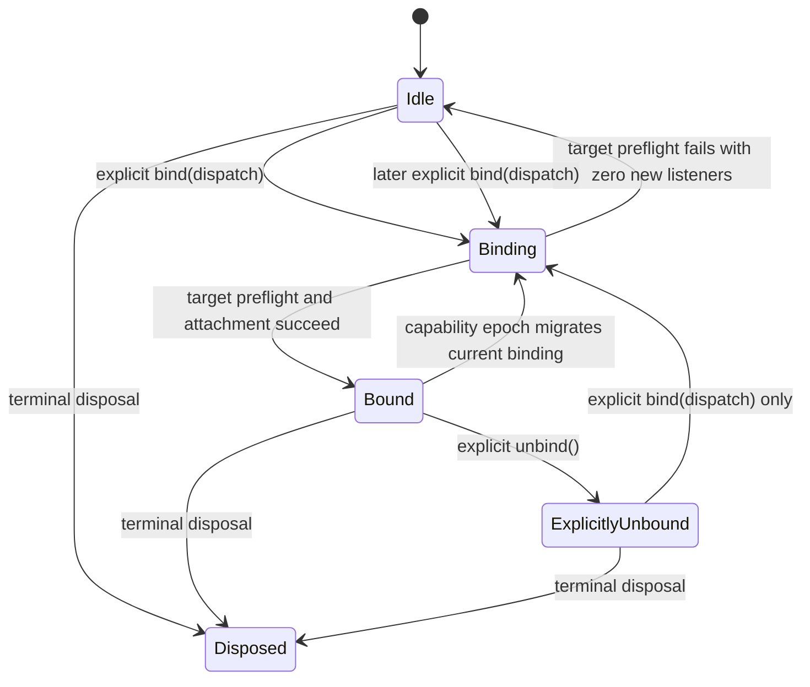

# AM-P0-002-F1 remediation review packet

> Retrospective Phase 0 pilot. The narrowed remediation received an independent `adequate` review and passed the required Node 22 validation, so implementation completed automatically under the Phase 0 rule. This operational packet is not normative and does not authorize commit, merge, or release.

<!-- prettier-ignore -->
```yaml
findingId: AM-P0-002-F1
findingPath: internal/autonomous-maintenance/phase-0/findings/AM-P0-002-F1.md
runId: AM-P0-002
stage: post-implementation-pilot
reviewStatus: completed
baselineCommit: 109083311d32c1a43ba3d66e55e7cd0b7c08f1dc

humanDecisions:
  semantic:
    status: accepted
    decision: Limit this remediation to target preflight, zero new listeners on target-resolution failure, explicit complete-plan retry, and explicit-unbind stability.
  integration:
    status: accepted
    decision: Commit the Event remediation separately from Props and experiment infrastructure; no merge or release was authorized.
    evidence:
      - c4a44df6e9489d0b344a7f7f7a959188ff16a5d3

automatedCompletion:
  status: complete
  rule: adequate-independent-review-and-required-validation
  validationStatus: passed
  completedOn: 2026-08-19

decisionRequested: []

authority:
  - id: M-EVENT-0001
    path: spec/modules/M-EVENT-0001.yaml
    lifecycle: draft
    changeRole: pre-existing-direction
    anchors: [M-EVENT-0001-F]
  - id: M-EVENT-0001
    path: spec/modules/M-EVENT-0001.yaml
    lifecycle: draft
    changeRole: proposed-draft-strengthening
    anchors: [M-EVENT-0001-I]
  - id: C-EVENT-0007
    path: spec/contracts/C-EVENT-0007.yaml
    lifecycle: draft
    changeRole: pre-existing-direction
    anchors: [C-EVENT-0007-A, C-EVENT-0007-B, C-EVENT-0007-C, C-EVENT-0007-D, C-EVENT-0007-E]
  - id: C-EVENT-0007
    path: spec/contracts/C-EVENT-0007.yaml
    lifecycle: draft
    changeRole: proposed-draft-strengthening
    anchors: [C-EVENT-0007-F]
  - id: HC-EVENT-BINDING-0001
    path: spec/host-caps/HC-EVENT-BINDING-0001.yaml
    lifecycle: draft
    changeRole: pre-existing-direction
    anchors: [HC-EVENT-BINDING-0001-E, HC-EVENT-BINDING-0001-F]
  - id: C-LIFECYCLE-0001
    path: spec/contracts/C-LIFECYCLE-0001.yaml
    lifecycle: draft
    changeRole: pre-existing-direction
    anchors: [C-LIFECYCLE-0001-C]
  - id: C-LIFECYCLE-0002
    path: spec/contracts/C-LIFECYCLE-0002.yaml
    lifecycle: draft
    changeRole: pre-existing-direction
    anchors: [C-LIFECYCLE-0002-F, C-LIFECYCLE-0002-G, C-LIFECYCLE-0002-H]

changeInventory:
  spec:
    - spec/modules/M-EVENT-0001.yaml
    - spec/contracts/C-EVENT-0007.yaml
    - spec/tests/T-EVENT-0001.yaml
    - spec/tests/T-EVENT-0003.yaml
  implementation:
    - packages/modules/event/src/kernel.ts
  tests:
    - packages/modules/event/test/contract/event-module.v0.contract.test.ts
    - packages/spec/fixtures/src/event/registration.ts

affectedSurfaces:
  direct:
    - EventKernel.bindAll target resolution order before listener attachment.
    - EventModuleImpl explicit bind retry and existing bound-only capability-epoch rebinding behavior.
    - RuntimeSession bind and unbind calls that distinguish explicit binding intent from target migration.
    - Draft Event Module and lifecycle-contract target-preflight semantics plus Module-level evidence mappings.
  indirect:
    - ModuleBase and CapsVault deliver synchronous capability epochs, but failed or explicitly unbound Event state now ignores them as before the remediation.
    - HostWiring and ViewEpochOwner can replace/reset Event capabilities; only a currently bound Event module transparently rebinds.
    - Boundary, Focus, Overlay, StateInteraction, and AsTrigger consume the Event port without owning host target resolution.
    - React, Vue, and Web Component adapters provide Event target capabilities and router mappings, but this remediation does not change their code.
    - Prototypes and hooks using def.event.on/onGlobal consume the resulting binding plan through RuntimeSession.
  excluded:
    - Automatic recovery of an initially failed bind is not part of this remediation.
    - Missing global-target recovery is unchanged and does not retain new retry intent.
    - Listener attachment, attach-then-throw, removal failure, rollback bookkeeping, and host-owned lease semantics are not claimed as fixed.
    - Event token identity, off precision, registration deduplication, successful dispatch ordering, Default Action, Expose Event, and Adapter translation are unchanged.
    - Run 001 Props remediation and reviewability infrastructure are outside the Event remediation inventory.
  unknown:
    - Non-Web host binding and removal failure contracts remain unresolved by HC-EVENT-BINDING-0001-Q-LEASE-SHAPE.
    - Raw EventTarget attachment or cleanup exceptions can still leave a partial state; this is recorded follow-up work, not a guarantee of the new criteria.
    - Target mapping mutation between completed preflight and attachment is not given snapshot or lease semantics.
    - Synchronous capability reentrancy from inside a hostile EventTarget remains outside the accepted scope.
    - Official Adapter repeatable view epochs with a failed initial Event bind do not have dedicated end-to-end evidence.

evidenceClaims:
  - id: E1
    claim: The verifier-corrected mixed semantic and host target-resolution failure adds no listener.
    proof: [EV-MOD-V0-1550, direct reproduction]
    limits: [Covers target-resolution failure only, not listener attachment or cleanup exceptions.]
  - id: E2
    claim: A capability epoch after failed target resolution does not bind the plan, while a later explicit bind retries the complete registration set.
    proof: [EV-MOD-V0-1550]
    limits: [Module fake capabilities do not constitute official Adapter failure-recovery evidence.]
  - id: E3
    claim: Explicit unbind remains unbound across a later capability epoch.
    proof: [EV-MOD-V0-1550, existing EventModuleImpl bound-only onCapsEpoch guard]
    limits: [Dedicated official Adapter repeatable-unmount evidence remains outside this Module-level case.]
  - id: E4
    claim: New target-preflight anchors are connected to cases and the Module test implementation.
    proof: [T-EVENT-0001 and T-EVENT-0003 traceability audit]
    limits: [Graph completeness does not establish semantic desirability or official Adapter failure-path conformance.]
  - id: E5
    claim: The broad automatic-recovery implementation rejected after round-one review is no longer in the actual remediation diff.
    proof: [packages/modules/event/src/impl.ts has no diff from baseline]
    limits: [Existing baseline lifecycle and hostile EventTarget debts remain.]

validation:
  mappedEvent: 10 files, 55 tests passed
  specFixtureAndGraph: 17 files, 36 tests passed
  checks: [check:types, check:prototype-catalog, check:agent-doc, check:autonomous-review, prettier, git-diff-check]
  traceability: T-EVENT-0001 and T-EVENT-0003 have zero verifies anchors missing case or required passing evidence.
  runtime: Node 22.23.2 local CI-equivalent run passed after round two; pnpm child processes also reported Node 22.23.2.

residualRisks:
  - id: R1
    title: Listener attachment and cleanup exceptions remain non-transactional.
    followUp: Track separately; do not present M-EVENT-0001-I or C-EVENT-0007-F as covering these failures.
    blocksCompletion: false
  - id: R2
    title: Raw EventTarget does not realize the draft host-owned idempotent lease shape.
    followUp: Resolve HC-EVENT-BINDING-0001-Q-LEASE-SHAPE before promising cross-host or failure-during-cleanup atomicity.
    blocksCompletion: false
  - id: R3
    title: Preflight does not reserve a stable target mapping through attachment.
    followUp: Gather evidence before defining snapshot, lease, or concurrent mapping semantics.
    blocksCompletion: false
  - id: R4
    title: New failure evidence is Module-level only.
    followUp: Do not claim official Adapter failure-path conformance; add it later only if that behavior is promoted into the host-cap contract.
    blocksCompletion: false
independentReview:
  required: true
  status: adequate
  reviewer: fresh Codex review task, round 2
  reviewMinutes: null
  decision: gather-more-evidence condition satisfied by subsequent Node 22.23.2 validation; implementation eligible for automated completion
  history:
    - round: 1
      classification: incomplete
      confidence: 0.99
      recommendedAction: revise
      summary: The broad packet correctly required revision but omitted production capability paths, existing lifecycle authority, Module consumers, synchronous reentrancy, and concrete rollback-failure consequences; the automatic-recovery state model was not approvable.
    - round: 2
      classification: adequate
      confidence: 0.96
      recommendedAction: gather-more-evidence
      summary: The narrowed packet matched the seven-path diff and accepted semantics; technical completion was recommended after repeating the final suites and checks on Node 22.
```

## Review decision

The human semantic decision is complete: this remediation is limited to target preflight and explicit retry. Round two independently classified this packet as `adequate` with confidence `0.96`, and the remaining Node 22 validation passed. The implementation therefore completed technically under the automated rule and was integrated as the separate commit `c4a44df6e9489d0b344a7f7f7a959188ff16a5d3`. Merge and release remain outside this packet.

The revised patch intentionally does not build a `pending-recovery` state machine. It restores `EventModuleImpl` to the baseline behavior and changes only `EventKernel.bindAll()` so every pending target is resolved before the first new listener is attached.

## Behavioral delta

| Scenario | Baseline | Revised remediation |
| --- | --- | --- |
| Semantic registration followed by missing ordinary root | Semantic listener attaches, then bind throws | Bind throws before any listener attaches |
| Capability epoch after that failure | Does not retry | Does not retry |
| Explicit bind after targets become available | Completes missing plan but preserves prior partial listener | Binds the complete plan from a clean unbound state |
| Successful bind, explicit unbind, then epoch | Remains unbound | Remains unbound |
| Missing global target | Fails before `lastDispatch` is replaced | Unchanged |
| Listener attachment or removal throws | May leave partial state | Unchanged and explicitly out of scope |

## State transitions

No new recovery state is introduced:



The implementation still uses `lastDispatch` and `isBound`, but the rejected transition from any `lastDispatch`-bearing unbound state on a capability epoch has been removed. `onCapsEpoch()` once again requires `isBound === true`.

## Change and impact map

The only implementation delta is:

```text
RuntimeSession.bindEvents
  -> EventModuleImpl.bind (baseline behavior)
     -> EventKernel.bindAll
        -> resolve every pending target
        -> only then call addEventListener for each pending registration
```

Production capability propagation still matters to review the boundary:

```text
HostWiring / ViewEpochOwner
  -> CapsVault epoch
     -> ModuleBase.onCapsEpoch
        -> EventModuleImpl.onCapsEpoch
           -> rebind only if currently bound
```

Boundary, Focus, Overlay, StateInteraction, and AsTrigger are indirect Event-port consumers. They do not call `EventKernel` or own target resolution, and their behavior is not intentionally changed.

## Authority analysis

There is no pre-existing active authority for initial bind-call atomicity. The applicable authority is draft:

- Existing direction: `M-EVENT-0001-F`, `C-EVENT-0007-A/B/C/D/E`, `HC-EVENT-BINDING-0001-E/F`, `C-LIFECYCLE-0001-C`, and `C-LIFECYCLE-0002-F/G/H`.
- New narrow proposals: `M-EVENT-0001-I` and `C-EVENT-0007-F`.

The new proposals cannot prove that the baseline violated a stable contract. They now explicitly exclude automatic failed-bind recovery and transactional semantics for attachment or cleanup exceptions. Explicit unbind remains unbound until a later explicit bind, consistent with the existing cleanup direction.

## Implementation argument

| Implementation change | Intended claim | Boundary |
| --- | --- | --- |
| Collect every pending registration target and wrapper before attachment | A later target-resolution failure cannot leave an earlier listener | Applies only to target resolution |
| Attach the collected registrations in the existing order | Successful behavior and dispatch ordering stay unchanged | Attachment exceptions retain baseline behavior |
| No `EventModuleImpl` change | No new automatic retry, global recovery, closure retention, or epoch exception path | Existing bound-target migration remains intact |

The previously attempted attachment rollback was removed because failure during removal can create a live listener with false diagnostics and duplicate delivery on later recovery. A reliable guarantee there requires a separate state/bookkeeping design or the host-owned idempotent lease shape already recorded as an open question.

## Evidence matrix

| Claim | Evidence | What it does not prove |
| --- | --- | --- |
| Target-resolution failure adds zero listener | `EV-MOD-V0-1550`; direct reproduction | Attachment/cleanup failure atomicity |
| Failed bind does not auto-retry on epoch | `EV-MOD-V0-1550` | Official Adapter end-to-end failure behavior |
| Explicit retry binds the complete plan | `EV-MOD-V0-1550` | Automatic recovery, which is intentionally excluded |
| Explicit unbind remains unbound after epoch | `EV-MOD-V0-1550`; bound-only epoch guard | Every repeatable Adapter lifecycle path |
| Spec case maps to Module evidence | Fixture and graph checks | Host-cap or official Adapter failure-path conformance |
| Broad implementation was removed | `impl.ts` equals baseline | Resolution of pre-existing raw EventTarget debt |

## Residual risks and limits

The first independent review demonstrated attach-then-throw, removal-throw, rollback bookkeeping, synchronous reentrancy, duplicate delivery, and cleanup interruption hazards. Those are real observations, but they are not silently claimed as fixed here. They remain follow-up work around the raw `EventTarget` realization and the draft host-owned lease model.

Preflight also does not reserve the selected target through attachment. Defining concurrent or reentrant mapping changes requires a separate semantic decision.

## Independent review

Round one classified the broad packet as `incomplete` with confidence `0.99` and recommended `revise`. Round two independently classified the narrowed packet as `adequate` with confidence `0.96`; it found no material packet correction and recommended gathering Node 22 evidence before technical completion.

The final suites and checks were then repeated with Node `22.23.2`, including confirmation that pnpm child processes used the same runtime. Event tests passed 10 files and 55 tests; spec fixture/graph tests passed 17 files and 36 tests; types, catalog, Agent document, review packet, formatting, and diff checks passed.

## Reviewer checklist

- [x] Confirm `impl.ts` has no remediation diff from baseline.
- [x] Confirm target resolution completes before the first new listener.
- [x] Confirm target-resolution failure adds zero listener.
- [x] Confirm a capability epoch after failed bind does not retry.
- [x] Confirm explicit bind retries the complete plan.
- [x] Confirm explicit unbind remains unbound after an epoch.
- [x] Confirm attachment, cleanup, reentrancy, global recovery, and host-lease semantics are not implied by the new criteria or test mappings.
- [x] Confirm `T-EVENT-0003` claims only Module evidence for the new case.
- [x] Re-run the final validation on Node 22 before technical completion.
- [x] Record the separate human integration decision: commit as `c4a44df6e9489d0b344a7f7f7a959188ff16a5d3`; merge and release not requested.
