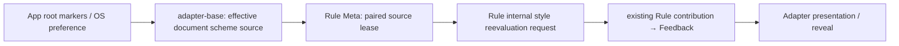

# 默认文档 colorScheme 重评估提案

日期：2026-09-14。基线：`1df2bd72e71a056cb7a36b7725b1563a1565394d`，`0.3.0-alpha.0`。

本文是[维护者决定 5652346587](https://github.com/Proto-UI/Proto-UI/issues/639#issuecomment-5652346587)允许的独立后续提案。#639/#643 的消费者研究已经完成；本次提交具体的通知、生命周期和兼容范围决策，等待维护者接受。本文及观察工具不实现新 port/capability，不改变产品行为或 spec lifecycle。

## 请求接受的八项决定

以下 S1–S8 是一组完整的推荐边界。接受本文不应被解释为任意 Meta key 获得响应式能力。

| 决定 | 推荐选择 |
| --- | --- |
| S1 通知归属 | `adapter-base` 提供默认 Web 文档主题变化源；已有 Rule Meta Module 持有订阅 bridge；Rule Module 保持唯一默认 Plan/样式贡献 owner。Website、Prototype 和 App callbacks 不承担库的失效通知。 |
| S2 实例与阶段 | 只订阅 authored Rule IR 含 `meta:colorScheme` 的 logical instance；首次进入 mounted 后建立租约并 fresh reconcile。保留 IR/getter 的 detached 实例不持有活动订阅。 |
| S3 detach/remount/terminal | unmounting 即撤订阅，detached 无环境样式写入；remount 新租约重新读取，不能用旧值缓存跳过首帧；disposing/disposed 撤租约并使迟到回调失效。 |
| S4 去重 | 每个符合条件的 logical instance 最多一份有效租约；默认 host service 在一个加载的 `adapter-base` 实例内按 Document 共享一组自有 observer/MQL listener；同批变化按最终有效值去重。 |
| S5 getter/selector 等价域 | 首轮只承诺默认 getter、同一文档、普通 light-DOM surface、没有中间局部主题标记的文档主题域。保留现有 eligible State/Meta Web lowering；未优化规则通过统一 Rule contribution 更新。 |
| S6 显式/system 优先级 | 复用现有 resolver 的精确顺序：root dark 标记优先于 light，再回退 system；监听 root `class`/`data-theme` 和 color-scheme MQL。显式覆盖下的 OS 变化不产生有效值通知。 |
| S7 custom/subtree 范围 | 自定义 `getMeta` 保留当前 sampled/experimental 行为，不自动接默认文档通知；不新增 subtree/nearest-theme、跨文档或 ShadowRoot 等价保证。现有 CSS 局部主题行为保留，并明确其不能证明 Meta 读取等价。 |
| S8 实施与验收 | 后续以内部 Rule 样式重评估入口、配对的 colorScheme-only source、四 Adapter wiring、draft 契约/测试和完整生命周期/浏览器矩阵交付；不调用 Proto structural update，不修改 Transition reducedMotion，不稳定化通用 Meta API。 |

这是选择默认文档主题的首个有界修复，不是全面修复所有环境作用域。S5/S7 的限制是接受决定的一部分，必须写进后续契约、Adapter 支持说明和测试结果，不能以一张根主题页面通过来掩盖反例。

## 现有权威与实际接缝

`D-RULE-META-NAMING-0001`、`C-RULE-WHEN-0002`、`M-RULE-0001` 和 `M-RULE-EXPOSE-STATE-WEB-0001` 仍为 draft。`C-RULE-WHEN-0002-D` 要求说明每种依赖变化是否、何时、如何触发重评估；现有 Meta 没有通用订阅。`C-RULE-RUNTIME-0001`、`C-RULE-EXTENSION-0001` 保持 Plan/宿主边界与等价执行要求。`C-AS-TRANSITION-0001` 和 `P-BASE-TRANSITION` 已有 reducedMotion 消费边界，本提案不改变它。

本次源码核对得到下列实施约束：

| 已有代码 | 可以复用的事实 | 不采用的捷径 |
| --- | --- | --- |
| `packages/modules/rule/src/impl.ts` 的 `evaluateAndApply()` | 已持有一个 Rule runtime contribution，经 `FeedbackPort.replaceStyleRuntime()` 替换完整 Plan。 | 它是 private，且会 `syncFromHost()`；不能假装现有 port 已能进行纯环境刷新。 |
| `packages/modules/rule/src/types.ts` 的 `RulePort.evaluate()` | 求值并返回 Plan。 | Adapter 另行应用结果会产生第二个执行器/贡献 owner。 |
| `packages/runtime/src/instance/session.ts` 的 `getRuleStyleTokens()` | 显式诊断求值。 | 它不 apply；不能用读取结果证明自动刷新。 |
| `packages/runtime/src/instance/execute/callback-scope.ts` | 现有 callback 负责 Props 同步、watch 派发和 after-callback queue。 | 空 callback 或 `runNoSync()` 仍可能派发 author watches；`deferAfterCallback` 在没有 callback 时不构成通用 scheduler。 |
| `packages/modules/feedback/src/create.ts` | `replaceStyleRuntime` 保留 recorder、patch、suppress 与现有 Effects 投射关系。 | 直接 `applyMergedStyle()` 不成为 Rule recorder contribution，后续 replay 可覆盖它；每次 `useStyleUnsafe()` 又会累积新贡献。 |
| `packages/adapters/base/src/wiring/host-wiring.ts` | `replace()` 实际先 reset 再 attach；`rebind()` 才是保留其它 entries 的挂接。 | getter 值变化不是服务身份变化，不能通过伪造 caps epoch 来通知主题。 |

已 mounted、exec phase 为普通 `unknown` 的 host 通知不需要伪装为 callback：Props 的 `get()` 返回已接纳 snapshot，State `.get()` 检查存活，Context `tryRead()` 的 runtime guard 不要求 callback-only，privileged Feedback replacement 也不要求 callback。Context 原有 host/订阅前提仍保留。首次 mounting 时 Feedback 的 proto phase 可能还是 setup，因而新入口必须等待已有 mounted driver，不能绕开这个 guard。

## S1：一个输入通知链，一个样式贡献 owner



建议新增以下**尚不存在的内部接缝**，具体标识作为本提案的一部分供审查；它们不是现在可导入的 API：

```ts
// NEW: addition to the existing privileged RulePort; no def/run author method.
type ProposedRulePort<Props extends PropsBaseType> = RulePort<Props> & {
  requestStyleReevaluation(): void;
};

// NEW: paired capability for the existing Rule Meta module.
type ColorSchemeInvalidationSource = {
  readonly getter: RuleMetaGetter;
  subscribe(invalidate: () => void): () => void;
};
// Proposed token name: RULE_META_COLOR_SCHEME_SOURCE_CAP.
```

`source.getter` 必须与当前 `RULE_META_GET_CAP` 中的函数为同一对象。它声明通知与读取属于同一 authority，不增加第二份主题值。默认 Adapter 在适配类型创建时一次构造 getter/source pair，owner/view wiring 传同一 pair。现有 getter 挂接的额外 wrapper lambda 应改为传入该精确函数；否则无法按引用验证配对。自定义 `opt.getMeta` 分支不提供默认 source。

`packages/modules/base/src/caps-vault/vault.ts` 当前原样保存并返回 cap value，且在一批 entries 完成后才递增 epoch，因此该引用配对不需要伪造 provider ID。`HostWiring.replace()` 的 reset/attach 空档仍需按下文处理，不能从单次 attach 的批次行为推断整个 replace 原子化。

Rule Meta 只在有效 mounted 租约且 pair 匹配时订阅。pair 缺失或不匹配时撤旧租约，保留已有 sampled getter 路径，不猜测或拼接两个 provider。真实 caps reset/reattach 只用于重绑租约，不作为主题值事件。这里的 identity 是普通 host capability 配对条件，不是认证或安全证明。

默认 source 的 `subscribe()` 不同步调用 invalidator；Module 安装租约后显式重新采样并请求一次 fresh reconcile，关闭首次读取/订阅之间的窗口。未来其它 provider 要实现这一内部契约，需要独立的 profile 证据；本提案不增加 App Maker-facing source option 或 generic `subscribe(key)`。

新 Rule port 复用已有 evaluate→replace 部分，并为环境请求使用**最后已接纳的 Props/State/Context 输入**。它不 `syncFromHost()`、不 consume/dispatch Props watch、不进入 author callback scope、不写 Props/State、不调用 `run.update()` 或 `controller.update()`。现有 State/lifecycle 路径的 Props 同步行为保留；可共用求值与替换代码，不能复制第二份 evaluator。

必须重新计算完整 default Plan，保持声明顺序、覆盖与 rollback；不能只 append “dark rules”。当前已由 Web optimizer 接管的规则仍由其既有贡献负责。首轮保证绑定当前官方 style Plan 与扩展，不声称任意第三方 `short-circuit.execute()` 没有副作用，也不私自略过已有 extension。

"无结构渲染"在新入口的调用边界上指不直接请求 Proto Runtime `renderOnce`、`host.commit(children)` 或 author `updated`。现有 React `setHostTokens`、Vue reactive tokens、Vue2 `$forceUpdate` 仍会更新框架 presentation；WC 仍由 owned-token applier 写宿主样式。这些投射与既有 reveal barrier 必须保留。

这里必须区分新入口与下游框架行为：React 的 layout effect、Vue3 的 `onUpdated`、Vue2 的 `updated` 仍会通知 Focus target readiness，后者经 `packages/modules/focus/src/create.ts` 进入既有 callback-safe sync；Vue 的更新阶段还会核对 Props。因此不能要求整个刷新过程的 `CallbackScope` 调用次数为零。

零 author watch/零 Proto structural cycle 的验收只用于当前颜色配方的静止样本：host Props 与已接纳 snapshot 一致，没有 pending Props、Focus 请求、既有 commit 或其它并发更新/生命周期工作。已有工作可以在正常同步点派发，author 显式请求的 update 也仍合法；不增加抑制层来隐藏它，也不阻断样式变化依既有协议产生的宿主事件。该边界保持 `A-VUE-3-0001-D` 及现有 Vue/Vue2 Props host-source 测试的行为。

## S2–S4：租约、阶段与去重

Rule Meta 从原始 `RulePort.exportIR().deps` 判断是否存在 `meta:colorScheme`。判断不依赖规则当时是否全部被 CSS lowering 接管，避免重绑定或 eligibility 变化后漏掉需要恢复的实例。只通过 `run.meta.get('reducedMotion')` 读取的 Transition 不因此订阅。

| 转换或刺激 | 拟议结果 |
| --- | --- |
| 无 colorScheme Rule | 无 source subscription；不为全部 Runtime 实例安装监听。 |
| setup / initial detached / mounting | 可以保存 IR/getter，但不申请环境样式写入；沿现有 mount、commit、Rule mounted 求值顺序前进。 |
| mount phase 到 mounted | 建立最多一个租约，再 fresh reconcile；不能用上个 view 的 last value 跳过。最新样式经现有各 Adapter reveal 协调到达首帧。 |
| perceptual leaving，view 仍 mounted | 继续跟随文档主题；不改变 transition phase、fallback duration 或 ViewIntent。 |
| mount phase 到 unmounting / detached | 立即撤租约，取消/失效 pending 通知；不写旧 view。Rule/Feedback 原有贡献清理与 replay 生命周期保留。 |
| detached 期间主题变化，再 remount | 使用新租约/generation 和当前值；保留一个 logical owner，不能靠重建 Runtime 来更新主题。 |
| owner/view caps reset、同 pair reattach | 先失效旧租约；仅在 pair 再次匹配且 phase 有效后重建，最多一份活动订阅。空 capability 窗口不被解释成 light/dark。 |
| source/getter 部分替换或移除 | 不匹配即撤订阅，旧回调失效；不把默认 source 接到自定义 reader。缺失时的读取继续按既有 sampled 路径处理，不承诺新的动态 provider API。 |
| same-view 物理 surface 替换 | 订阅持有 Rule port，不持有 DOM/Effects target；使用现有最新 Feedback capability 和重绑定投射，验证不会写旧 surface。 |
| disposing / disposed | off、失效 generation、清 pending；迟到 callback 不触及 disposed Rule port。新 notification port 对 inactive/terminal driver 不 apply；既有 evaluate 的 disposed 行为不变。 |
| StrictMode / KeepAlive / WC reconnect | 使用各自的 owner/view 生命周期，不以框架 effect 次数计订阅；重复 retain/release 后计数恢复。 |

一个逻辑实例的唯一租约由 Rule Meta 管理，不能在四 Adapter 各自的 owner/view builder 中启动两个 observer。Bridge 需要真实的 mount/instance/caps/dispose hooks；当前只有 `onProtoPhase` 的 Rule Meta wrapper 不会自动清理外部资源。

默认 host service 在同一加载的 `adapter-base` 模块实例中，以当前 realm 的 Document 为键共享自有 root MutationObserver 和 color-scheme MQL change listener。首个订阅时才连接，最后一个释放时 disconnect/remove listener；不在 import 或组件类型定义时永久监听。不声称不同 bundle/package 副本之间的全局唯一性，也不把 Website 或 App 自己的监听算成库的重复订阅。

没有 Document/MutationObserver 时不提供活动 source，getter 的现有 fallback 保留。MQL 不可用时只观察明确的根标记，system 分支仍使用现有 light fallback；不能因观察工具或 SSR 环境缺少平台对象而在 import 时抛错，也不据此宣称整个 Adapter 获得 SSR 支持。

同一 host 变化批次读取最终有效 scheme。root class/data-theme 同批改变、无关 class 改动、显式覆盖下的 OS 改动，只有 resolver 结果实际变化才广播。一次可观察批次给每个活动实例至多一次 invalidation。若一个批次内 dark→light→dark 最终值未变，可以不发通知；不保证未绘制中间态逐个可见。

如实现需要排队，pending work 必须绑定 pair 和租约 generation，执行前检查存活并读取最新 getter。不得仅把工作放入 `deferAfterCallback` 后等待下一次用户交互。这里不新增通用调度器，也不承诺固定毫秒延迟；验收点是该环境变化批次及宿主 presentation effects 完成后的最终配方。

## S5–S7：保持精确的等价范围

默认源必须调用 `packages/adapters/base/src/platform/web-preferences.ts` 中现有 resolver：先判断 root `data-theme=dark` 或 `.dark`，再判断 light，最后读取 system。冲突的 root 标记保留当前 dark-first 顺序；删除明确标记必须重新计算 fallback，而不是等下一次 OS change。

此 slice 只观察 `class`、`data-theme` 与 `(prefers-color-scheme: dark)`。不观察 reduced-motion MQL，不把主题变化变成 Transition 重新计时，也不监控任意环境字段。

当前 `meta.dark` lowering 直接产生 `dark:`，绕过 native State variant policy；将该 policy 设 false 不能禁用 Meta lowering。通用 dark CSS selector 能匹配任何祖先或自身的 dark marker，默认 getter 却读全局 document root。新增通知本身无法消除这种来源差异。

| 配置 | 第一阶段支持决定 |
| --- | --- |
| 默认 getter，同文档 light DOM，无中间局部主题标记，root 显式 light/dark | 新通知与默认 Plan 重评估必须成立；既有 lowered 控件与未优化 Button 的最终配方一致。 |
| 同上，root 无明确标记，system 变化 | 新通知必须使用相同 resolver；验证显式标记加入、移除与 OS 优先级。 |
| 同文档 portal 且仍满足上述无局部覆盖条件 | 由同一 document source 驱动；必须验证重绑定后的真实 surface/reveal，不能仅检查 logical boundary。 |
| 自定义 `getMeta` | 保留当前显式求值/普通生命周期中的 sampled 读取，不附加默认文档 subscription；不新增自动 custom invalidation 或与 dark selector 的等价保证。 |
| root light＋局部 dark，或期望局部 light 截断 root dark | 不建立 nearest-subtree Meta scope；既有 CSS 行为保留，反例明确列为本次新增保证之外。通知可能仍更新默认 root reader，但不能将结果称为 subtree 等价。 |
| 跨 document、iframe/adoption、ShadowRoot | 不由当前全局 document/window getter 推导支持；需要单列来源、selector 和 view 证据后再决定。 |

这些边界不禁止 App 的 `surfaceClass`、`surfaceStyle`、CSS 变量或显式视觉覆盖；也不把视觉覆盖提升为 Meta 的输入 authority。第一阶段不修改 #578 的 Website scope ancestry、复制主题变量、renderer 缓存或 DOM restamping。

## 为什么选择这一阶段

| 备选 | 评价 |
| --- | --- |
| A：默认文档通知，保留当前 lowering，并精确限制新增保证 | **推荐。** 直接解决已复现的 Button prop + meta 失效需求；复用唯一 Rule/Feedback owner；保留现有优化和实验性 custom/subtree 行为。其局限是反例仍需独立兼容决策，不能称为全面修复。 |
| B：新增 Meta-specific eligibility / root-specific selector 或派生 marker 协议 | 可进一步证明自定义 reader/作用域与 CSS 的一致性，但现有 native variant policy 不够，需要新的投射、作用域与迁移规则。当前先保留为后续选择，不把它藏进一个 observer 补丁。 |
| C：停止 colorScheme selector lowering，统一默认 evaluator | 可统一 getter 对条件的解释，但会改变当前局部 dark CSS 行为、现有优化保证和 token 更新成本。未经明确兼容决定，不为少写通知代码而直接退役优化。 |

选择 A 的依据是维护者要求一个由具体消费者驱动的 bounded proposal，以及本次补充的来源反例。它不解决所有可构造的环境组合；B/C 的取舍需要额外的真实消费者需求与独立接受。若维护者要求本轮涵盖这些更广范围，应改写所选方案和验收，不能继续用 A 的正向矩阵宣称完成更广目标。

## S8：拟议实施图与验收

建议将实施作为一个完整的默认文档主题 slice：

1. 在既有 Rule port 中增加内部请求入口，共用 evaluate/replace owner，明确环境路径不拉取或派发新的 Props 工作。
2. 为既有 Rule Meta Module 增加配对的 colorScheme-only source 和真实生命周期 hooks；保留原 getter、`ctx.readMeta` override 及 reducedMotion 消费方式。
3. 在 `adapter-base` 实现默认文档 source，四个 Adapter 的默认分支传入同一 getter/source pair；自定义 getter 分支保留 sampled 行为。
4. 同步 draft 规范、Module/host input/Adapter/Test 图与文档，完成以下矩阵后再提交实施 PR。不要先生成 passing T mappings 或空身份。

拟议 catalog 图是：新增有界 `C-RULE-COLOR-SCHEME-0001`、`M-RULE-META-0001`、`HC-COLOR-SCHEME-INVALIDATION-0001` 和 `T-RULE-COLOR-SCHEME-0001`；修订现有 `M-RULE-0001`/`T-RULE-0002` 及四 Adapter profile 的精确支持范围。这些 ID 尚未创建，均需随真实实现与证据以 draft 入库并说明 `lifecycleRationale`。M 的职责限定为现有实验 reader 加这一个输入的 bridge，不接纳通用环境协议。`D-RULE-META-NAMING-0001` 保持通用命名未稳定；不新增 Prototype 或改 Core author-facing `def/run` surface。

| 实施验收组 | 必须证明的结果 |
| --- | --- |
| 源与优先级 | root dark/light 冲突顺序、明确覆盖、OS 变化、标记删除、无 DOM fallback；有效值相同零广播。 |
| 去重与资源 | 一个 service-owned observer/MQL listener、多实例各一租约、无消费者零活动资源；同批 mutation 一次通知；最后释放、late callbacks 和 generation 失效。 |
| Rule 样式 owner | Button 型 Prop/State/Meta 混合 Plan；无交互即可 Light→Dark→Light 正确更新；完整声明顺序、单贡献替换、patch/suppress 和已有 extension 行为保留。 |
| 纯环境入口 | 在当前颜色配方、Props 已同步且无其它 pending 工作的静止样本中，不增加 Proto render/commit/author updated 或 author watches；新 port 不直接同步/派发 Props、发 Expose command 或写 State。允许并分别计数框架 presentation 与现有 callback-safe sync。 |
| Props 并发 | 保留正常 Props 同步、watch 和显式 update，包括 `autoUpdate=false` 下合法的 watch 派发；记录动作来源，不能把现有工作当作新 bridge 直接调用，也不能伪造或重复提交。 |
| 生命周期 | initial detached、首 mount/reveal、leaving 仍 mounted、unmounting late signal、detached 翻转/remount、同 epoch surface replacement、terminal dispose，以及 StrictMode/KeepAlive/reconnect。 |
| pairing | owner/view reset 空档、同 pair 重附、source/getter 部分更换、移除、旧回调迟到；无交叉配对、无重复租约。 |
| 四 Adapter 真实绘制 | Button 配方与 Checkbox/Switch/Textarea 邻居；computed tokens/paint、host identity、首次 reveal 和无结构 render；同文档 portal 和 split Textarea surface。 |
| 排除项与兼容 | custom/subtree/跨文档不被误报为新增支持；非 colorScheme Rule 不订阅；Transition reducedMotion、已排队 fallback 与 phase/event/ViewIntent 序列不变。 |
| 工程与交付 | 相关 Rule/Meta/Feedback、Runtime、四 Adapter、CLI token closure、类型、catalog、包预算/依赖和完整测试；规范 projection 通过，独立 exact-head review。 |

动态通知和任何新的 port/capability 目前都没有实现；上表是后续实施验收，不是本次通过数。没有增加 generic Meta API、Context 扩展、state intent、A11y/Presence 清理或发布任务。

## 本次现状证据

在上述基线，以 Node 22.23.2、pnpm 10.32.1、Chromium 152.0.7977.83 重新运行已合入的 `2026-09-13-rule-meta/browser-observations.mjs`：四个 Button journey、十二个相邻控件 journey、六个 Transition journey 完成。Button 和其它控件样本与原始数据一致，确认问题仍存在；没有把旧研究重新算成本次方案。

新增的 [scope 观察工具](./evidence/2026-09-14-color-scheme-proposal/scope-observations.mjs)通过现有 Web Component Adapter 与真实 Shadcn Textarea 构造四个 App-owned 样本，保留默认 getter 或明确传入 constant-dark 自定义 getter。局部 marker 属于测试 App 容器，读取器函数的记录也放在该容器上；没有克隆组件 DOM、改 Proto 规则或把测试 reader 当新的协议状态。

[原始 JSON](./evidence/2026-09-14-color-scheme-proposal/observations.json)记录四种 root 状态下的十六个样本。默认样本通过同一共享默认 resolver 重新读取，custom 样本调用其实际传入的 getter；`declaredScheme` 是这些 fixture 采样值，不声称被优化的 Rule 当时调用了 getter。

| 现状样本 | getter 值 | 实际背景 |
| --- | --- | --- |
| root light / 默认 reader | light | transparent |
| root light / 默认 reader / 局部 dark marker | light | input tint（alpha 0.3） |
| root light / constant-dark reader | dark | transparent |
| root dark / 默认 reader / 局部 light marker | dark | dark input tint（alpha 0.045），局部 light 不建立 nearest Meta scope |
| 无 root 明确标记 / system dark / 默认 reader | dark | dark input tint |
| 无 root 明确标记 / system light / 默认 reader | light | transparent |

已检查[显式 light 截图](./evidence/2026-09-14-color-scheme-proposal/explicit-light.png)与[显式 dark 截图](./evidence/2026-09-14-color-scheme-proposal/explicit-dark.png)。它们证明当前 reader/selector 的作用域差异，不能算作拟议通知机制已经成功的证据。新反例矩阵是 WC/Web 的证据；四运行时根主题基线来自前述独立的二十二个 journey，不把一个 WC 反例扩写为完整非 Web conformance。

复现命令：

```sh
corepack pnpm@10.32.1 exec tsx internal/records/evidence/2026-09-14-color-scheme-proposal/scope-observations.mjs
```

工具复用现有 docs/browser harness；结果写到日志给出的临时目录。截图和 JSON 经检查后原样保留。它不是新 CI gate，也不固定尚未接受的行为期望。

本次相关检查为 13 个文件、58 项测试通过；`check:types` 通过，其中 Astro 检查 198 个文件、零错误/警告/提示；`check:agent-doc`、`check:prototype-catalog`、局部格式与 diff 检查通过。完整 `corepack pnpm@10.32.1 test` 通过：461 个非浏览器测试文件、2,193 项测试，以及 18 个浏览器测试套件、82 项测试；其中发布脚本另有 52 项测试通过。原有 3 个 skipped 文件、34 个 Rule matrix TODO 保持原状。

上述二十二个现状 journey 已重新运行；新的 scope 工具复跑后，JSON 和两张截图与保留文件逐字节一致。独立本地只读审查在声明的 partial 深度内没有发现实质问题，结论为 ABSTAIN，不构成平台批准或未实现机制的验收。

请维护者接受或修订 S1–S8，并明确后续实施是否可按该有界图启动；本提案自身不作语义批准。
