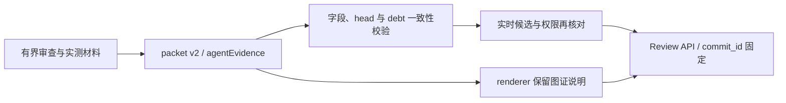

# 2026-09-15 Agent 证据执行链修正

本记录接续[历史 Issue 图证续补](2026-09-15-agent-evidence-followup.zh-CN.md)，不修改旧观察，也不改变 Issue 状态或产品语义。

## 请求与修复范围

Agent 脱敏转述：处理现有 PR 的 Request Changes，同时完善测试和 skill；证据工作由 Agent 承担，人可以只描述现象。PR #651 的维护者指出，文字规则没有完整进入 review、claim 和历史补证的实际路径。本批只修这些路径和可续跑记录，不声称已补完历史 Issue 或通过独立验收。

旧 head `d3f86f7b470bd0033681643b7399aef95a6edff9` 上，`validateReviewPacket()` 接受没有公开证据说明的 packet；零 finding 的 `renderReviewBody()` 直接返回 head 一行。新增的缺字段回归用原有合法 packet，实测失败为 `Missing expected exception`，不是依赖或启动错误。

修正后的 review packet v2 将 `agentEvidence` 传入真实提交 renderer：请求转述与来源、证据范围、baseline/head、环境与时间、步骤和观察、图片/源码链接、disposition 和缺口逐项保留。零 finding 路径也不丢字段。精确 head 不匹配会拒绝；`partial`/`blocked` 加明确 debt 可通过，无图片数量门槛。旧 v1 只保留为历史核对材料；必须重新核对事实后才能制作 v2，不允许仅改版本号。

该图解释本次源码及单元测试覆盖的传输链，不是组件截图，也不证明 GitHub 上已有一次新版本真实提交。公开链接访问和内容脱敏仍由执行 Agent 实际检查，JSON 形状不能证明图片真实或可访问。测试中的 `example.com` 是明确的离线传输夹具，不是上传回执。

`pui-select` 的证据评估进入已经批准的 claim 全文；`pui-claim` 不临时扩写获准文字。新 `pui-evidence-publish` 仅发布一条已准备、明确授权的 Issue 补充评论，并保留无写入、重复或结果未知的回执。它不上传、创建存储、认领、关闭或修改原文；需要的新资产先在单独授权的准备工作中完成。注册 C2 类别不等于授予自治发布权。

## 账本位置与数量更正

可恢复的逐项账本现存于 [2026-09-15-issue-backfill-ledger.json](evidence/2026-09-15-issue-backfill-ledger.json)。它是本 PR 中受版本控制的持久执行记录，不是本机临时路径或产品生成文件。每行记录 Issue URL/state、请求来源与 prompt 未知边界、评论抓取和阅读状态、已有证据质量、复现范围、图片/源码 URL、评论回执、缺口和下一步。六条已发表材料沿用原回执，不伪称本次重跑；未读的其余讨论标为 unknown，而不是缺少图片。

明确更正上一份续补记录把 **514** 条评论与“六条证据已回读”放在同一时间口径的问题：`2026-09-15T06:13:30.458Z` 的保存快照为 **228 Issues、515 comments**（61 open / 167 closed）。#3 的证据评论 `5673875673` 于 `2026-09-15T02:43:42Z` 发布，已经早于旧 head `4605458162cd2da499372e85c6c419756124c0a1`，所以 514 不能描述该 head 之后的完整总量。旧记录保留历史数值，由本条纠正其适用口径；并未声称今天任何更晚时刻仍只有 515 条。

快照按 `CREATED_AT DESC` 分页取得 50/50/50/50/28 条 Issue，逐 Issue 评论继续分页至 `hasNextPage=false`；独立核对 URL、评论 ID 唯一性及每条评论 count。账本保留每页 cursor、每 Issue 评论 ID/末尾 cursor 和输入 SHA-256，供重查。抓取完整不等于阅读完整。

进度仍为 **6 条限定范围已发布、222 条待补**，其中六条也保留更广范围的 debt；并不是六个 Issue 已解决。按 `createdAt DESC, number DESC` 从最新未完成项继续，当前下一项 #645。不要按最近评论时间排序，也不要为了补证更改 closed 历史。

## 验证边界

独立复核后的第二轮区分上传欠账、范围内验证欠账与范围外工作。新增反例实测：首个候选把范围内未复现行为只写入 `agentEvidence.debt`，原授权判断仍返回 `allowed:true`。现在该类 `verification` debt 会阻止 REQUEST_CHANGES、APPROVE 和 merge；有明确授权的 COMMENT 仍可披露。只有上传/展示欠账仍是软门禁，不把图片数量变成人类合入门槛。缺口分类需要有事实依据，不能用 outside-scope 偷换必需审查范围。

另一条独立场景复核发现“目标更新后停止写入”与“重复回执 no-op”措辞有交叉，已明确：停止的是新写入，只读核对同 marker/body/author 的既有评论仍可返回回执；新实质讨论仍需重新阅读。六个模拟场景和四个缺 artifact 负例已通过，非真实外部发布验收。

聚焦 review/runtime 与 integration 测试覆盖缺字段拒绝、零 finding 的实际 renderer、错误 head、非公开/带凭据 URL、debt 一致性，以及既有授权、重复、CI 和 merge 防护。路由测试覆盖 claim 缺证据评估、publication 缺精确授权、终态回执缺账本更新等负例。无全量产品行为变更、组件复现或真实发布成功声明；完整验证结果与候选 commit 绑定在 PR 跟进中。
