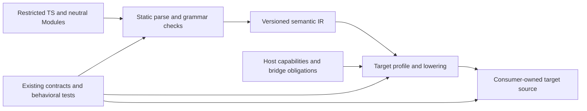
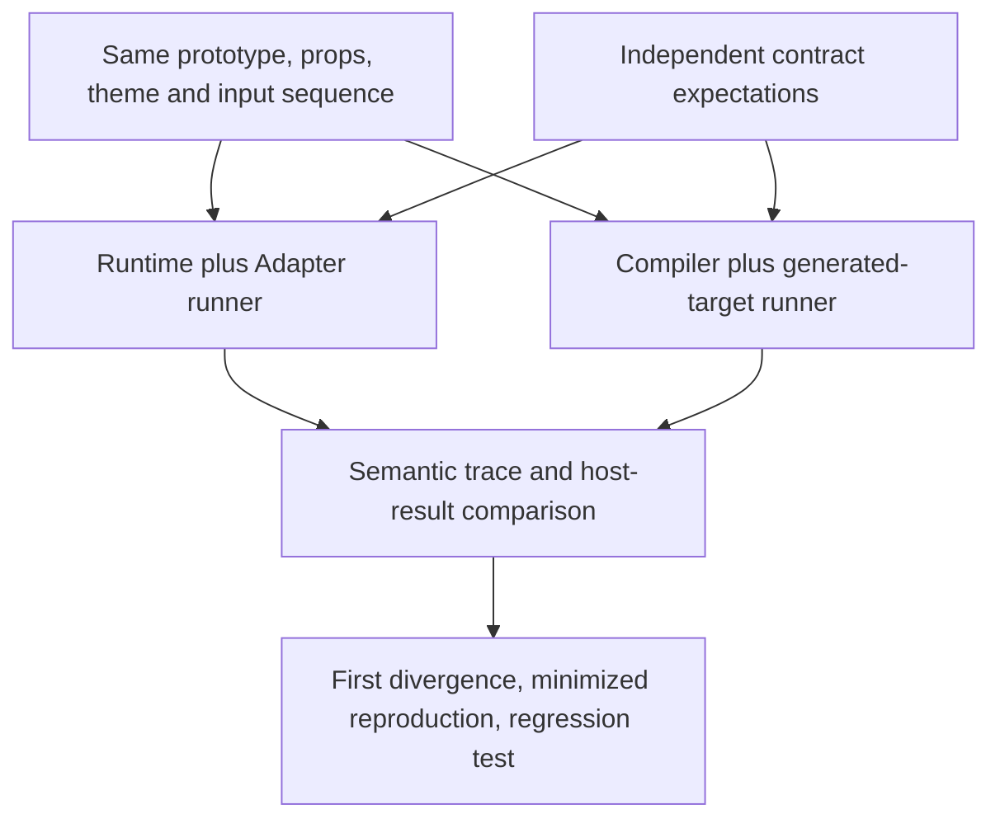

# Meeting follow-up and compiler implementation direction

This is a nonnormative work plan following the [September 24 meeting](2026-09-24-product-and-compiler-discussion.md). Meeting directions, later engineering recommendations and open design questions are distinct. Applicable `spec/**` entities remain authoritative. This record does not declare a compiler package, supported profile or release ready.

## Direction and authorization

Expand usable prototypes first, make interaction knowledge available through skills, and actively advance the compiler plan in parallel. Continue GPUI work; retain Flutter's practical appeal. A React experiment is not a change to platform or market priorities.

The late meeting converged on readable TypeScript trimmed into a checked neutral subset, identified by `.proto.ts` for prototypes, with unsupported syntax rejected. Shared neutral Module logic needs a corresponding convention. Exact grammar, callback representation, IR and shared-file names still need design.

After checking the meeting alignment, the requesting maintainer explicitly asked the agents to begin implementation and create Issues and PRs, without self-imposed effort, round or sample-count caps. The earlier document-only assignment is superseded for subsequent implementation. This does not promote new semantics to stable guarantees, authorize unrelated merges or releases, or certify contribution rights on another person's behalf.

## Workstreams and concrete outputs

| Workstream | Next deliverable | What it must establish |
| --- | --- | --- |
| Prototypes | Coverage/gap map followed by coherent component contributions with knowledge, contract, tests and usable examples | Existing GPUI work continues; a component-count estimate does not gate useful delivery. Revise abstractions when platform evidence reveals gaps. |
| Knowledge skills | Component-selection/generation workflow and runnable examples, with mature-library, knowledge-assisted and unassisted-AI comparisons | Reuse a suitable mature library; generate from reviewed knowledge/tests where one is missing. This can start before compiler or adapter infrastructure. |
| Compiler | Checked source subset, semantic IR, target lowering and real executable tests, followed by reviewable code PRs | Output follows current semantic contracts, is editable by consumers, and reports precise unsupported cases and target limits. |

Weekly demand sensing and participation in relevant community conversations inform all three. Supply useful artifacts before requiring adoption of Proto-UI itself. Record concrete tasks, alternatives, failure cases and maintenance cost; stars or component counts are not demand measurements.

The skill/library route was discussed as a separate project. Its final name, repository and product boundary are open. Core maintainers can maintain component interaction knowledge; business-specific blocks and scenario skills mainly invite community contributions. Findings should improve the knowledge base even when a product experiment fails.

Implementation tracking: [compiler and differential conformance #732](https://github.com/Proto-UI/Proto-UI/issues/732), [native mixing and lifecycle #733](https://github.com/Proto-UI/Proto-UI/issues/733), and [knowledge skill #734](https://github.com/Proto-UI/Proto-UI/issues/734). Prototype coverage continues in [existing #377](https://github.com/Proto-UI/Proto-UI/issues/377); this record does not reassign existing contributors.

## Product boundary

Compile neutral prototypes into readable target-ecosystem source that consumers can own and edit. Keep the existing Runtime/Adapter route available. Reducing delivery burden is a goal; the meeting did not forbid every explicit helper or host bridge.

Native component mixing remains a product goal. Design must address node identity, parent/child relationships, context, props/expose and host lifecycle. Defer a target when realizing necessary capabilities would effectively require rebuilding its framework. A test limited to generated components must not be presented as the eventual product boundary.

The core owns knowledge, semantics, prototypes and a small official implementation set. Broader adapter/backend and target-version support needs community ownership, with recognition of strong community implementations. Design capability declarations, shared behavioral checks and maintenance responsibility now; do not wait for a perfect official backend before considering community participation.

## Engineering recommendation

This is a proposed architecture, not an implemented pipeline. The contract/test edges mean verification obligations, not runtime dependencies.

1. Keep the initial implementation in TypeScript and isolate its parser API. Do not expose TypeScript AST nodes as a permanent domain IR contract.
2. Analyze source statically. Define supported declarations, expressions, control flow and imports. Do not execute arbitrary setup/callback code or dynamic imports to discover structure. Unsupported constructs get stable diagnostics and precise source spans, without partial output or silent semantic loss.
3. Use a Proto-UI-owned, versioned, data-only semantic IR. Explicit operations represent analyzed logic; opaque target-code strings must not masquerade as portable semantics. `RuleIR` covers Rule only; `TemplateChildren` is not a complete compiler IR.
4. Lower through exact target/version profiles with explicit host capability and lifecycle mappings. Compare direct lowering, modular helpers and explicit bridges transparently. A zero-Proto-runtime experiment tests one strategy, not the validity of the entire compiler direction.
5. Make generated files consumer-owned. Initially create only when the destination is absent; regenerate separately for a user-reviewed diff. No silent overwrite, automatic merge or promise of bidirectional synchronization.
6. Compiler diagnostics point to original source spans. Runtime debugging follows the target toolchain's JS-to-consumer-source mapping; optional prototype provenance must not pretend to remain accurate after arbitrary consumer edits.
7. Record source grammar, IR schema, compiler/backend, target versions and toolchain. Same input and versions should produce deterministic output. State licensing/provenance and maintenance responsibilities before distribution; a stable plugin ABI can follow evidence from real backends.

## Starting implementation, then expanding

A later 26-round agent design discussion proposed the existing `P-BASE-BUTTON` direct entry plus a static setup-time `asButton()` caller as an initial end-to-end fixture, targeting React/react-dom 19.2.6. This uses existing code and tests to expose compiler problems; the meeting did not choose React as the first market. Button is a starting point, not a workload ceiling.

| Step | Implement | Verify |
| --- | --- | --- |
| Source/IR | Explicit accepted syntax, import resolution, semantic operations and capability requirements | Positive/negative inputs, accurate spans, no execution of source, no AST leakage or hash-based fixture bypass |
| Backend | Editable target source with documented ownership/lifecycle strategy | Exact-version independent build, applicable Button interaction/a11y/event/lifecycle behavior, deterministic output and create-only writes |
| Source sensitivity | Controlled pointer-enter/hover source mutation | Changed semantics affect emitted behavior; compilation is not a hardcoded Button template |
| Host integration | Native mixing and bridging examples, or precise unimplemented capability cases | Distinguish logical owner disposal from host detach/rebind; resolve ViewIntent applicability against current contracts, rather than claiming blanket parity |
| Expansion | More semantics, components and targets supported by actual evidence | Continue useful work after the first slice; document a blocked case and progress independent cases instead of stopping the whole lane |

Review current `C-LIFECYCLE-0008` and `C-HOST-VIEW-ATTACHMENT-0001` status and criteria before lifecycle implementation. Do not waive an applicable criterion because an experiment would be easier without it. Equally, do not turn one unresolved case into an invented prohibition on all implementation.

Use comparable tasks, environments and acceptance conditions for mature-library, knowledge-assisted and unassisted-AI results. Report failures and costs. Prior agent suggestions of 36+9 runs, 20% improvement per participant, a two-user threshold or a four-week/90-minute study are optional study designs, not meeting decisions, industry standards or prerequisite gates.

## Primary acceptance: compiler and Adapter equivalence

The subsequent user direction makes equivalence the main implementation concern, including internal and external evidence. A buildable generated component is not sufficient. The first implementation should include a reusable differential harness alongside the source/IR/backend path.

For an admitted source `S`, supported target/environment `T`, and allowed input sequence `I`, the required relation is semantic observational equivalence between `Runtime + Adapter(S, T, I)` and `Generated(S, T, I)`. This is an obligation across the declared supported domain, not a claim that a finite test run proves equivalence for arbitrary TypeScript or every host. Unsupported syntax or capabilities must be rejected before output, not silently omitted.

Both paths must also independently satisfy their applicable contracts. A matching Adapter bug is not correctness. Classify first divergences as compiler defect, Adapter baseline defect, contract ambiguity or harness defect. Preserve the failing case and resolve the owning layer; do not rewrite expected output to make the comparison pass.

The comparison needs these layers:

| Layer | Evidence | Important failure controls |
| --- | --- | --- |
| Source and lowering | Parser/IR/backend unit and property tests; supported effects, control flow, imports, capability needs, provenance and determinism | Negative inputs; semantic preservation obligations per lowering rule; no execution of source or fixture-hash bypass. Bounded formal/model checks can strengthen a supported subset without claiming an arbitrary-program proof. |
| Internal semantics | Independent observations of props/state/expose changes, event values/order, update boundaries, ownership, lifecycle epochs, context and cleanup | Shared trace schema, not compiler-generated expected traces. Check intermediate transitions, stale callbacks and non-effects. |
| Differential sequences | Same event/prop/lifecycle sequence on both runners, including model/property-generated sequences | Record seeds; shrink mismatches to minimal reproductions; test comparator and normalizers; mutations must be detected. Synthetic scheduling is disclosed, not called native behavior. |
| External interaction | Real browser or native-host input, focus/tab/key/pointer behavior, disabled/default action, outward events and accessibility name/role/state/tree | Same fixture and environment; independent contract expectations; actual intermediate behavior rather than final screenshots alone. |
| Rendering | Real CSS, computed styles, ownership/restoration/priority, layout, paint and hit-testing, per style family | Actual stylesheets and rendered captures. Any visual tolerance must be justified by nondeterministic rendering, not hide a missing semantic state. |
| Composition and lifecycle | Strict replay, updates, detach/rebind, terminal disposal, native/generated mixing, wrappers, context/props/expose and logical ancestry; portals/overlays as admitted | Distinguish owner lifetime from view attachment. Unsupported combinations stay explicit and remain product follow-up work. |
| Consumer boundary | Clean install/build/run of generated output with frozen dependencies and inspection of the real dependency closure | No accidental monorepo access; helpers/bridges are declared and tested. Hand-edited output is a separate consumer workflow, not unchanged-output parity evidence. |

Observable equivalence does not require identical private data structures or incidental DOM bytes. Every permitted normalization needs a reason and a test showing it cannot erase a meaningful difference. Never normalize away event order/count, cancellation/default action, lifecycle ownership, logical ancestry, focus, accessibility, exposed state or other contract-relevant behavior. Control clocks and readiness at explicit boundaries; do not add sleeps until a race disappears.

Maintain a criterion-to-case-to-run matrix binding grammar/feature, prototype/style family, contract and lifecycle status, Adapter and generated target versions, internal/external test paths, collected case counts, actual result and omissions. Use `PASS`, `FAIL`, `UNSUPPORTED`, `UNTESTED` and `BLOCKED` distinctly; a skip or empty test selection is not a pass. Record source/compiler/Adapter commits, lockfile, runner/browser versions, seed and first-divergence evidence.

CI must detect differential regressions, unsupported inputs falsely accepted, comparator failures, missing expected test collection and generated-fixture drift. Independent fresh examples and negative cases should challenge the producer's own checks. Code snapshots, typechecks, shared case definitions and browser journeys each contribute evidence; none alone justifies a claim of complete equivalence.

## Community practice and current baseline

The inspected references do not establish a universal cross-framework UI compiler standard. They support a combination of established practices:

- [ESTree](https://github.com/estree/estree) and [Babel Generator](https://babeljs.io/docs/babel-generator): syntax-tree and emission tools, not definitions of Proto-UI interaction semantics.
- [TypeScript Compiler API](https://github.com/microsoft/TypeScript/wiki/Using-the-Compiler-API): version-sensitive frontend APIs; keep their boundary isolated.
- [ECMA-426](https://tc39.es/ecma426/): source-map format and decoding, not a guarantee that every generated statement maps back to an unchanged prototype.
- [rustc diagnostics](https://rustc-dev-guide.rust-lang.org/diagnostics.html): narrow spans, context and actionable diagnostics without duplicate root-cause noise.
- [LLVM testing guide](https://llvm.org/docs/TestingGuide.html): separate unit, regression and integration checks. Golden output is not interaction conformance.

The inspected repository baseline is `41f3ff175ef802142aeac89acc2159c342b6a5fc`. The [Compiler Guide](../../apps/www/src/content/docs/en/build/compiler-guide.md) documents no supported compiler in 0.2. The [contribution rules](../../CONTRIBUTING.md) require source, host/output ownership, parity, lifecycle/capabilities, version/conformance and Runtime coexistence to be explicit. Existing catalog constraints still apply; the [compiler discussion #584](https://github.com/Proto-UI/Proto-UI/issues/584) is background, not implementation evidence.

## Provenance and current evidence limits

The meeting record is an AI-assisted, de-identified English rendering of project-relevant Chinese discussion supplied by a participant for publication. Original media, personal details, private locations and unrelated conversation are not included. The full automatic transcript was used to correct the earlier overstatement that every direction was undecided; the audio has not been listened through for this publication.

Codex prepared the records and compared meeting passages; Astra supplied design discussion and a subsequent alignment review. No third-party implementation was copied into this documentation change. Public references inform the recommendations. Human review and individual DCO certification are not claimed by the agents. This document itself contains no measured compiler, browser, demand or consumer-pilot result; implementation results belong in subsequent code PRs with actual commands and outputs.
